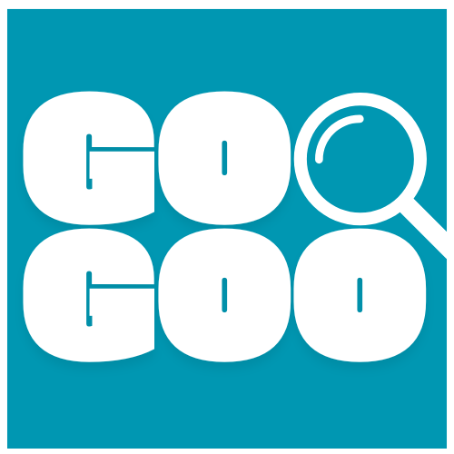

[![Contributors][contributors-shield]][contributors-url]
[![Forks][forks-shield]][forks-url]
[![Stargazers][stars-shield]][stars-url]
[![Issues][issues-shield]][issues-url]
[![GNU General Public License][license-shield]][license-url]

<!-- PROJECT LOGO -->
 

  

<h3 align="center">GOKS by GooGoo</h3>
  

    Automated essay grading based on <strong>RELEVANCE, PLAGIARISM, AND AI SCORE</strong>
  

  

    Do you find checking essays too boring? Do you have to check  hundreds or even thousands of them? GOKS has got you covered. GOKS aims to improve your productivity by automating your essay grading. All you need to do is enter your source material (a summary of a lecture, a presentation, book, etc.) and a csv containing your essay prompt in the first row and all the essays you need to check in the subsequent rows. It grades the essays based on its relevance to the source material and the question, and even based on their plagiarism and AI score. Try it now!
     
    <a href="https://github.com/megaraph/goks-by-googooo"><strong>Explore the docs »</strong></a>
     
     
    <a href="https://github.com/megaraph/goks-by-googooo/issues">Report Bug</a>
    ·
    <a href="https://github.com/megaraph/goks-by-googooo/issues">Request Feature</a>
  

<!-- TABLE OF CONTENTS -->

  
Table of Contents

  <ol>
    <li>
      <a href="#about-the-project">About The Project</a>
      <ul>
        <li><a href="#built-with">Built With</a></li>
      </ul>
    </li>
    <li><a href="#license">License</a></li>
  </ol>

<!-- ABOUT THE PROJECT -->

## About The Project

### Screenshot
![GOKS Screen Shot][product-screenshot]

(<a href="#top">back to top</a>)

https://github.com/user-attachments/assets/edacba96-b9a2-4a46-9d2e-37b97ea46420
![GOKS Video][demo-video]
### Demo Video

(<a href="#top">back to top</a>)

### Built With

-   [![React][React.dev]][React-url]
-   [![Flask][Flask.palletsprojects.com]][Flask-url]
-   Groq

(<a href="#top">back to top</a>)

<!-- GETTING STARTED -->

<!-- LICENSE -->

## License

Distributed under the GNU General Public License. See `LICENSE.txt` for more information.

<!-- MARKDOWN LINKS & IMAGES -->
<!-- https://www.markdownguide.org/basic-syntax/#reference-style-links -->

[contributors-shield]: https://img.shields.io/github/contributors/megaraph/tab-scheduler.svg?style=for-the-badge
[contributors-url]: https://github.com/megaraph/goks-by-googooo/graphs/contributors
[forks-shield]: https://img.shields.io/github/forks/megaraph/tab-scheduler.svg?style=for-the-badge
[forks-url]: https://github.com/megaraph/goks-by-googooo/network/members
[stars-shield]: https://img.shields.io/github/stars/megaraph/tab-scheduler.svg?style=for-the-badge
[stars-url]: https://github.com/megaraph/goks-by-googooo/stargazers
[issues-shield]: https://img.shields.io/github/issues/megaraph/tab-scheduler.svg?style=for-the-badge
[issues-url]: https://github.com/megaraph/goks-by-googooo/issues
[license-shield]: https://img.shields.io/github/license/megaraph/tab-scheduler.svg?style=for-the-badge
[license-url]: https://github.com/megaraph/goks-by-googooo/blob/main/LICENSE
[product-screenshot]: img/screenshot.png
[demo-video]: https://github.com/user-attachments/assets/daedfbb6-8083-4a48-bf44-c198d173a639
[React.dev]: https://img.shields.io/badge/React-%2320232a.svg?logo=react&logoColor=%2361DAFB
[React-url]: https://react.dev/
[Flask.palletsprojects.com]: https://img.shields.io/badge/Flask-000?logo=flask&logoColor=fff
[Flask-url]: https://flask.palletsprojects.com/en/stable/
[Flask.palletsprojects.com]: https://img.shields.io/badge/Flask-000?logo=flask&logoColor=fff
[Flask-url]: https://flask.palletsprojects.com/en/stable/
